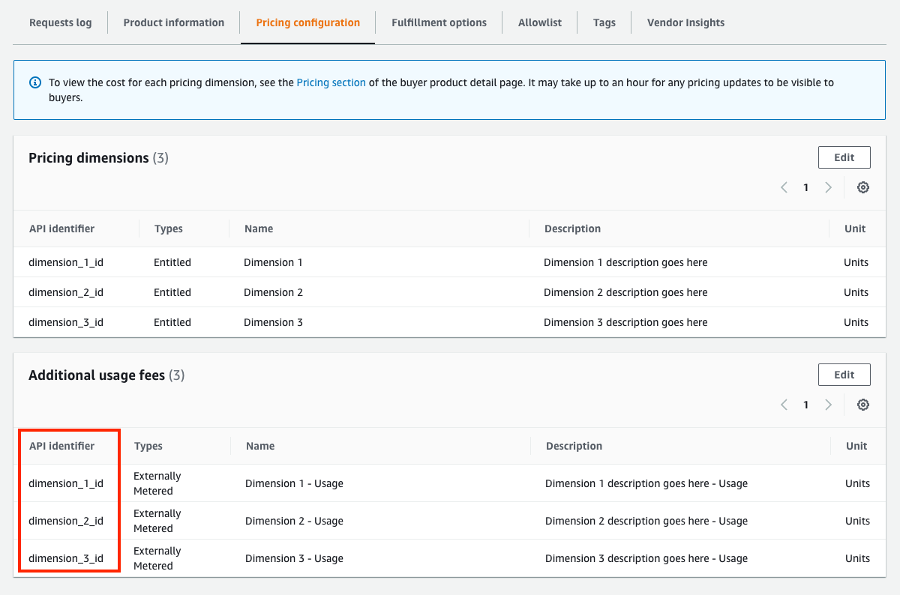
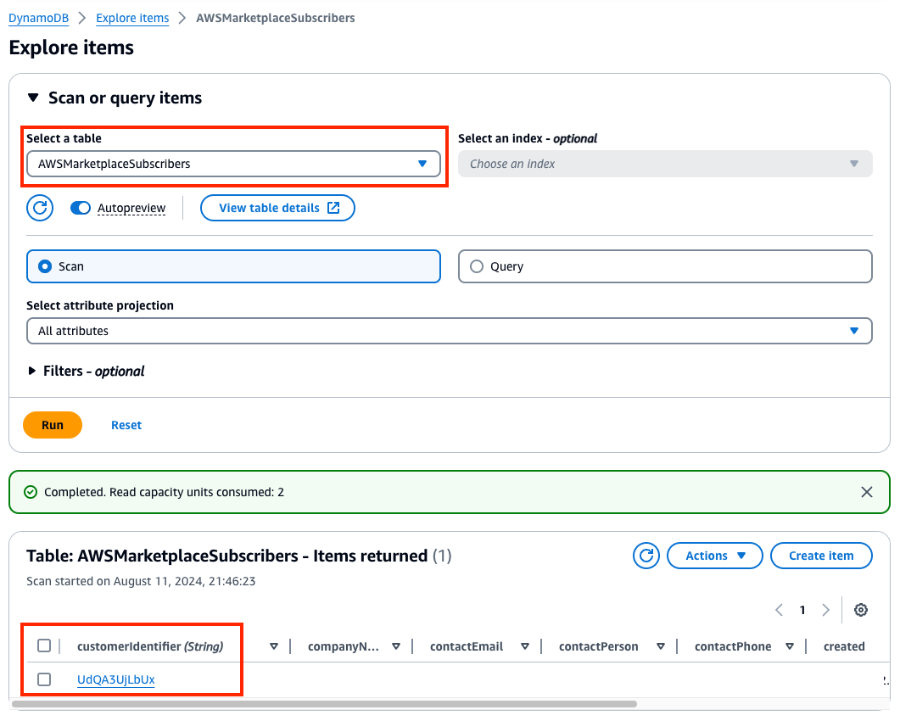

# AWS Marketplace CSV-based Metering Solution
This optional add-on works with the [AWS Marketplace Serverless SaaS Integration](https://github.com/aws-samples/aws-marketplace-serverless-saas-integration) to give sellers a manual, simple, CSV-based method for publishing custom metering usage to AWS Marketplace. **Do not** use this unless you have a Limited or Public listing for a SaaS product on AWS Marketplace using the Serverless SaaS Integration.

## Intended for
- Sellers with a SaaS product listed with "subscription" (usage-based) or "pay-as-you-go" (contract with consumption) [pricing models](https://docs.aws.amazon.com/marketplace/latest/userguide/saas-pricing-models.html) on AWS Marketplace. This does not work with contract-based pricing or other [product deliver methods](https://docs.aws.amazon.com/marketplace/latest/userguide/product-preparation.html).
- Manual reporting of [metered usage records](https://docs.aws.amazon.com/marketplace/latest/userguide/metering-for-usage.html) to AWS Marketplace.
- Sellers with low volume of Marketplace transactions.
- Sellers who need a simple method for reporting metered usage records to AWS Marketplace without involving developers to build a custom integration between their system and AWS.
- Sellers who have a less-technical Seller Admin who need to report metered records to AWS Marketplace on a recurring basis.

## How it works
1. **Manual upload**: Seller (alliance lead) uploads a custom CSV with usage data from their SaaS application, for a specific customer ID gathered from the Subscribers DynamoDB table, to report metered usage for all dimensions and values listed in the CSV to AWS Marketplace.
2. **Event Notification**: A S3 Event Notification triggers a Lambda function automatically once the file is uploaded.
3. **Transform CSV to JSON**: The Lambda function reads the CSV file from the S3 bucket and processes each row of dimensions and values, plus the current timestamp, to created JSON inserting into the Metering Records DynamoDB table.
4. **Insert Item**: The Lambda function inserts the JSON containing the customer ID, all metered dimensions and values, and timestamp to DynamoDB.
5. **Hourly records publish**: Each hour, the Serverless SaaS Integration automatically processes any new records in DynamoDB and publishes them to the the Marketplace API, reflecting state and status back to DynamoDB.

## How to deploy the solution - AWS Administrator
To deploy the AWS Marketplace CSV-based Metering Solution, you'll want to access you AWS seller account as an administrator. Then follow these steps:
1. Obtain the Metering Records table name deployed by the [AWS Marketplace Serverless SaaS Integration](https://github.com/aws-samples/aws-marketplace-serverless-saas-integration) to your account (default is **AWSMarketplaceMeteringRecord**).
2. Using CloudFormation, create a new Stack using the **marketplace-csv-metering.yaml** template in this repo. Input the Subscriber table name into the **DynamoDBMeteringTableName**.
3. After the Stack is created successfully, navigate to the **Resources** tab and open the link to **S3Bucket**.
4. Under **Properties**, navigate to **Event notifications** and click **Create event notification**.
5. Create an event notification with the following:
    1. Event name: **S3EventNotication**.
    2. Event types: **Put** / s3:ObjectCreated:Put (only).
    3. At the bottom, choose the Lambda function created by the Stack: **marketplace-csv-metering-<UID>**.
    4. Click **Save changes**.
7. Using IAM, modify the Role used by your Seller Admin to attach the following additional permissions:
    1. [Read access](https://docs.aws.amazon.com/IAM/latest/UserGuide/reference_policies_examples_dynamodb_specific-table.html) to the two specific DynamoDB tables deployed by the Serverless SaaS Integration (defaults are **AWSMarketplaceSubscribers** and **AWSMarketplaceMeteringRecord**). Or use the**AmazonDynamoDBReadOnlyAccess** AWS managed policy.
    2. Read and write access to the S3 bucket created by the **marketplace-csv-metering** Stack. Or use the **AmazonS3FullAccess** AWS managed policy.

The CSV Metering integration is now prepared and you can now provide steps to your Seller Admin for how to login to AWS, access DynamoDB and S3, and upload CSV files using the following section.

## How to create and upload CSV metering records - Seller Admin
To publish metering records to AWS Marketplace for customer usage from your SaaS application, you will use the steps below to create and upload a CSV file for each customer. This process is manual and is recommended only for low Marketplace transaction volume.

1. Login to your AWS seller account, used to manage your AWS Marketplace Management Portal (MMP) product listings.
2. After logging into AWS, login to [MMP](https://aws.amazon.com/marketplace/management/homepage).
3. Navigate to your product listing under Products > SaaS.
4. Open the details of your Subscription or Pay-as-you-go product listing and navigate to **Pricing configuration**.
5. Under the **Usage fees**, note the **API identifier** of the usage dimensions configured for the product. These will be the available dimensions you use for publishing SaaS usage data to AWS Marketplace as metered records.

6. Next, navigate to **DynamoDB** in the AWS Management Console. Open the Subscribers table (default is **AWSMarketplaceSubscribers**). Click Explore table items to view all items in the table, which reflect subscribers of your product. Find the **customerIdentifier** that corresponds to a customer that you need to published metered records for.

   
5. Obtain CustomerIdentifier from Subscribers table
6. Obtain Usage Dimensions from Marketplace Management Portal
7. Create CSV file: put CustomerIdentifer as name of file (i.e., QEFN33TJED.csv where CustomerIdentifier = QEFN33TJED)
8. In Excel or Text Editor, insert rows for each Usage Dimension and the value to report to Marketplace
9. Save the file, login to AWS and upload to S3 bucket
10. In a few minutes, verify Metereing Records table for new entry
11. In an hour, the entry will update and publish to Marketplace
12. In a day, the CSV file will automatically delete from the S3 bucket
